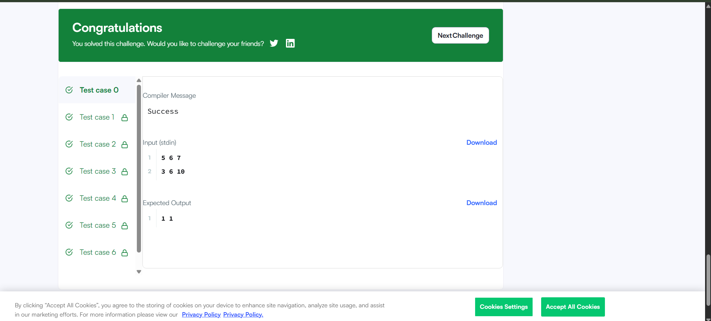

# Compare the Triplets

## Problem
Compare Alice's and Bob's ratings in three categories and calculate their scores.

## Approach
- Compare Alice's rating with Bob's rating for each category.
- If Alice's rating is higher, increment Alice's score.
- If Bob's rating is higher, increment Bob's score.
- If both ratings are equal, neither score is incremented.
- Return the two scores.

## Example

Alice:

5 6 7

Bob:

3 6 10

Output:

1 1

Alice receives one point and Bob receives one point.

## Complexity

- Time: O(N)
- Space: O(1)

## HackerRank Result

Accepted.

